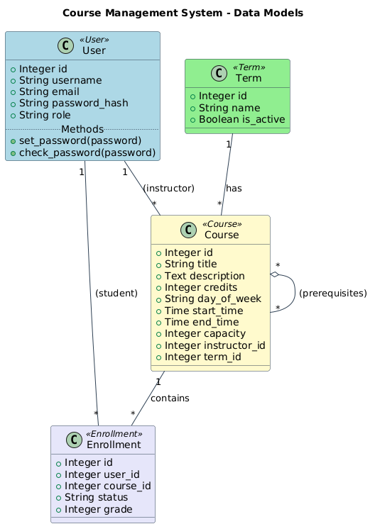

# Comprehensive Course Management Portal

[](https://www.python.org/)
[](https://flask.palletsprojects.com/)


A full-featured, Flask-based web application designed to streamline the management of academic courses, student enrollments, and instructor workflows.

<br>

<p align="center">
  
</p>

<br>

## 📋 Table of Contents

- [About The Project](#about-the-project)
- [Key Features](#key-features)
- [Tech Stack](#tech-stack)
- [Project Architecture](#project-architecture)
- [Getting Started](#getting-started)
  - [Prerequisites](#prerequisites)
  - [Installation](#installation)
- [Usage](#usage)
- [Contributing](#contributing)
- 

## 📌 About The Project

This project is a powerful and modular course management portal designed to simplify academic administration for educational institutions. The system provides a clean, user-friendly interface for three distinct roles: **Students**, **Instructors**, and **Administrators**.

From managing academic terms and course catalogs to handling smart enrollments and generating reports, this portal covers the essential functionalities required for an efficient learning management system. It is built to be both robust and easily extensible.

## ✨ Key Features

### 👨‍🎓 For Students
- **Smart Enrollment**: Enroll in courses with automatic validation for prerequisites, seat capacity, and **schedule conflicts**.
- **Personalized Dashboard**: View a weekly class schedule, neatly organized by day.
- **Academic Transcript**: Instantly access a detailed transcript with course grades, credits, and a calculated **GPA**.
- **Enrollment Management**: Withdraw from courses before the registration period ends.
- **Course Catalog**: Browse available courses with detailed descriptions, schedules, and instructor information.

### 👨‍🏫 For Instructors
- **Course Management Panel**: Easily view a list of all courses being taught.
- **Class Rosters**: Access up-to-date lists of enrolled students for each course.
- **Grade Submission**: A simple and efficient interface for submitting and updating student grades.

### ⚙️ For Administrators
- **Central Dashboard**: Get a high-level overview of the system with key metrics (total students, instructors, courses, etc.).
- **User Management**: Create, view, and modify user accounts, including the ability to **change user roles**.
- **Comprehensive Course Control**: Create new courses with detailed attributes (instructor, term, prerequisites, capacity), edit existing ones, or delete them entirely.
- **Term Management**: Define academic terms and control their status (e.g., open/closed for registration).
- **System Reports**: Generate dynamic reports, such as the **most popular courses** based on enrollment numbers.

## 🛠️ Tech Stack

- **Web Framework**: [Flask](https://flask.palletsprojects.com/)
- **Database**: [SQLite](https://www.sqlite.org/)
- **ORM**: [SQLAlchemy](https://www.sqlalchemy.org/)
- **Database Migrations**: [Flask-Migrate](https://flask-migrate.readthedocs.io/en/latest/)
- **Web Forms**: [Flask-WTF](https://flask-wtf.readthedocs.io/en/stable/)
- **Authentication**: [Flask-Login](https://flask-login.readthedocs.io/en/latest/)
- **Frontend**: [Bootstrap 5](https://getbootstrap.com/)

## 🏗️ Project Architecture

The project follows a modular structure inspired by the **MVT (Model-View-Template)** pattern, which is common in Flask applications:

- **Model**: Defines the database schema and relationships using SQLAlchemy classes. Located in `app/models.py`.
- **View (Route)**: Contains the core application logic that handles user requests and renders responses. Defined in `app/routes.py`.
- **Template**: Consists of HTML files that display data to the user. Located in the `app/templates/` directory.

This separation of concerns makes the application easier to maintain and scale.

## 🚀 Getting Started

Follow these steps to get a local copy up and running.

### Prerequisites
- Python 3.8 or higher
- `pip` package manager

### Installation
1.  **Clone the repository:**
    ```bash
    git clone [https://github.com/your-username/course-portal.git](https://github.com/your-username/course-portal.git)
    cd course-portal
    ```

2.  **Create and activate a virtual environment:**
    ```bash
    # On Windows
    python -m venv venv
    .\venv\Scripts\activate

    # On macOS/Linux
    python3 -m venv venv
    source venv/bin/activate
    ```

3.  **Install the required packages:**
    (It is recommended to first create a `requirements.txt` file with `pip freeze > requirements.txt`, then run the command below)
    ```bash
    pip install Flask Flask-SQLAlchemy Flask-Migrate Flask-Login Flask-WTF python-dotenv
    ```

4.  **Initialize the database:**
    To create the database file (`app.db`) and apply the schema, run the following command:
    ```bash
    flask db upgrade
    ```
    This command uses the migration scripts in the `migrations` directory to set up your database tables.

5.  **Run the application:**
    ```bash
    flask run
    ```
The application will now be available at `http://127.0.0.1:5000`.

## 🕹️ Usage

Once the application is running, you can explore its features:

1.  **Create an Admin User**: To access all management features, you must first have a user with the `admin` role. You can create one by writing a small script or manually inserting a record into the database.
2.  **Log In**: Use the login page to access role-specific dashboards.
3.  **Admin Workflow**: As an admin, you can navigate to the management panels to create new terms, courses, and users.
4.  **Student Workflow**: As a student, you can browse the course catalog, enroll in available courses, and check your dashboard and transcript.

## 🤝 Contributing

Contributions are what make the open-source community such an amazing place to learn, inspire, and create. Any contributions you make are **greatly appreciated**.

To contribute:
1.  Fork the Project.
2.  Create your Feature Branch (`git checkout -b feature/AmazingFeature`).
3.  Commit your Changes (`git commit -m 'Add some AmazingFeature'`).
4.  Push to the Branch (`git push origin feature/AmazingFeature`).
5.  Open a new Pull Request.
